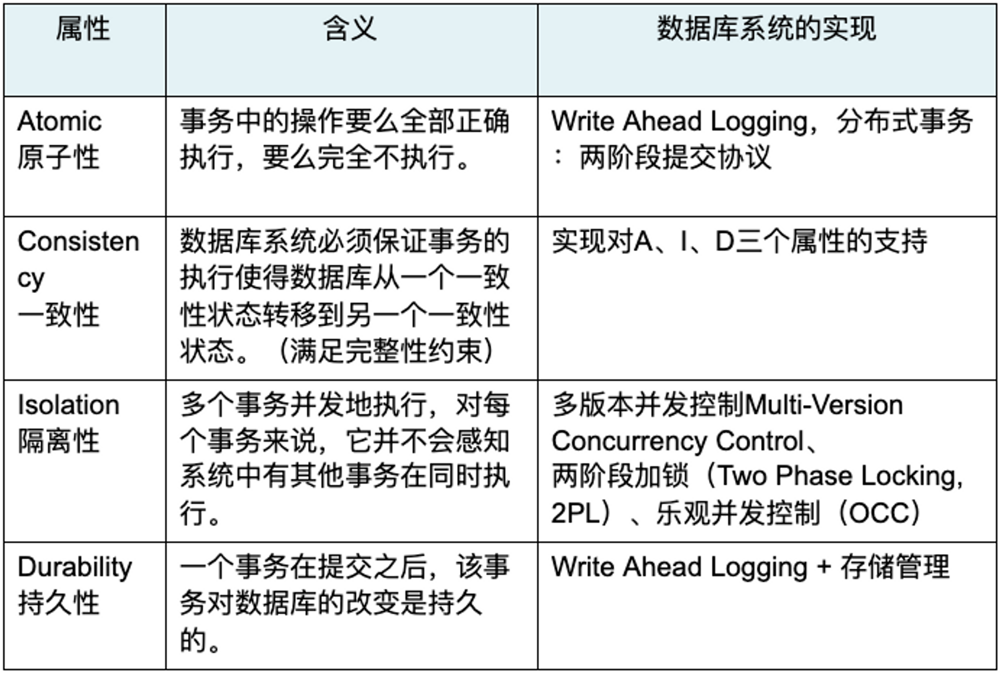

- #greenplum #分布式事务 #数据库 #OCC #2PL #MVCC #WAL #ACID
- [src](https://cn.greenplum.org/greenplum_distributed_transaction/)
- [[分布式数据库ACID的实现]]
  id:: 64ce7f84-1e3f-4433-a603-9fd681b81d8e
	- {:height 405, :width 563}
	  💡这个图更多的是greenplum的分布式数据库视角，不能跟单机[[innodb]]一一对应
- 先有事务的概念，然后再补上事务之间可见性的问题 #card
  id:: 64abcde3-2332-4713-85f5-5893125bf1e9
	- Jim Gray于1981年VLDB描述了事务的原子性A、一致性C和持久性D，在此基础上，Haerder和Reuter在1983年中提出了**事务的[[隔离性]]**并提出术语“ACID”，自此，事务的ACID四个性质成为业内标准术语。
	  id:: 64abcdeb-737d-49fb-a377-c13876652d89
- MySQL同样采用[[MVCC]]，事务恢复的时候为什么需要[[undo log]]？ #card
  id:: 64abce98-6057-4864-9903-d2fa14c15ff9
	- 这是因为版本的存储方式（[[Version Storage]]）不同。
	  1. Greenplum和PostgreSQL上，Greenplum和PostgreSQL有redo log，没有undo Log，任何对tuple的修改都在主表上创建一个新的tuple进行修改，再通过一个指针指向新的tuple。在heap表的存储空间里，已经有元组的旧值，不需要额外通过undo log记录旧值。
	  2. MySQL和Oracle的Version Storage的实现是另一种机制：Delta Storage。把的差异变化记录到Delta Storage里，形成一个链，这种差异的存储被称为[[rollback segment]]，即[[回滚段]]。
	  {:height 274, :width 655}
	  💡Mysql在主表之外记录历史差异；PG在主表上添加新版本，较旧的版本指向较新版本。pg的查询会比mysql慢吗？
	- 如果对Version Storage感兴趣，可以去阅读论文 《Yingjun Wu, An Empirical Evaluation of In-Memory Multi-Version Concurrency Control, VLDB 2017》
- WAL是否适合新硬件特点：高速非易失性随机写
	- 比如说CMU在VLDB2016 提出了在NVRAM基础上实现的数据库恢复的协议——Write-Behind Logging #TODO