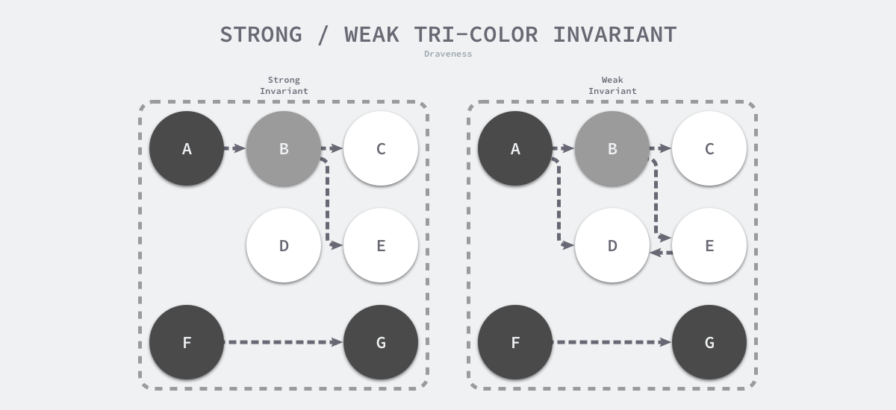

- #go #gc
- [屏障技术 draveness.me](https://draveness.me/golang/docs/part3-runtime/ch07-memory/golang-garbage-collector/#%e5%b1%8f%e9%9a%9c%e6%8a%80%e6%9c%af) 就是在并发或者增量标记过程中保证三色不变性的重要技术。
	- 想要在并发或者增量的标记算法中保证正确性，我们需要达成以下两种三色不变性（Tri-color invariant）中的一种：
	- 强三色不变性 — 黑色对象不会指向白色对象，只会指向灰色对象或者黑色对象；
	- 弱三色不变性 — 黑色对象指向的白色对象必须包含一条从灰色对象经由多个白色对象的可达路径[7](https://draveness.me/golang/docs/part3-runtime/ch07-memory/golang-garbage-collector/#fn:7)；
	- 
	- Go 语言中使用的两种写屏障技术，分别是 Dijkstra 提出的插入写屏障[8](https://draveness.me/golang/docs/part3-runtime/ch07-memory/golang-garbage-collector/#fn:8)和 Yuasa 提出的删除写屏障[9](https://draveness.me/golang/docs/part3-runtime/ch07-memory/golang-garbage-collector/#fn:9)