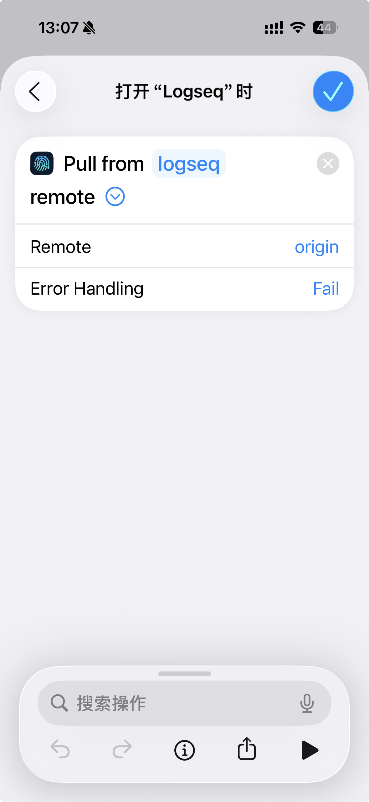
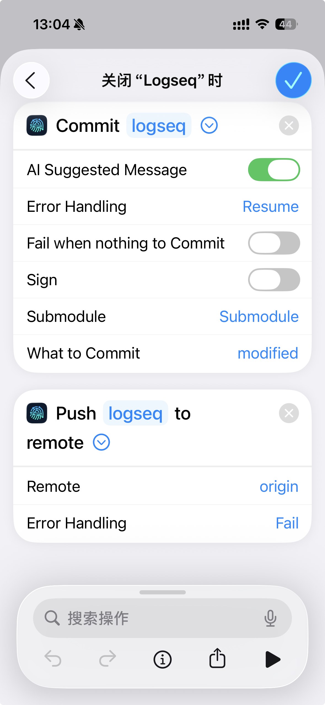
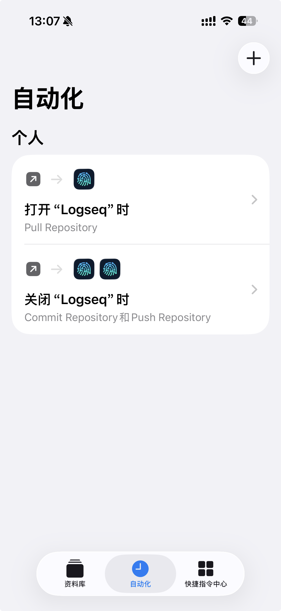
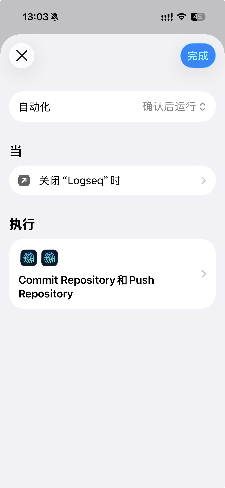

blog:: true
updated:: [[2025-10-20]]
created:: [[2025-10-20]]
status:: [[DONE]]

- {{embed ((68efd73a-0d67-4647-b96a-6c98f8c9ae10))}}
-
- 你是否也曾被 Logseq 或 Obsidian 在多设备间使用 iCloud 同步时的文件冲突搞得头疼不已？今天，我将为你介绍一种稳定且高效的替代方案，让你可以在 iPhone 上使用 Git 自由地编辑和同步笔记，彻底告别并发编辑冲突的烦恼。
- ---
- ## **问题的根源：iCloud 同步的痛点**
	- Logseq 和 Obsidian 都是强大的知识管理工具，它们都基于本地 Markdown 文件系统。当我们使用 iCloud 在 iPhone、iPad 和电脑之间同步时，由于 iCloud 的同步机制，很容易出现文件版本冲突，尤其是在网络不佳或多设备同时编辑的情况下，严重时甚至会导致数据丢失。
- ---
- ## **终极解决方案：Git + Working Copy**
	- 为了解决这个问题，我们引入 Git——强大的版本控制工具。通过 Git，我们可以精准地控制文件的每一个版本，有效避免冲突。而在 iPhone 上，实现这一切的核心就是一款名为「**Working Copy**」的 App。
	- **优点：**
		- `稳定可靠`：Git 的版本控制机制从根本上避免了文件冲突。
		- `版本历史`：你的每一次修改都有记录，可以随时回溯。
		- `掌控力强`：可以精确控制何时拉取（Pull）和推送（Push）更新。
	- **缺点：**
		- `成本`：需要购买 Working Copy 的 Pro 版本，价格为 199 元。但考虑到它能一劳永逸地解决同步问题，这笔投资是值得的。
		- `上手门槛`：相比 iCloud 的“无感”同步，需要一些初始设置。
- ---
- ## **手把手教你设置**
	- **第一步：在 Working Copy 中克隆你的笔记仓库**
		- 确保你已经将笔记文件夹（Logseq 的 Graph 或 Obsidian 的 Vault）初始化为 Git 仓库，并将其托管在 GitHub、Gitee 或其他 Git 服务平台上。
		- 下载并打开 Working Copy App，购买 Pro 版本。
		- 在 Working Copy 的设置 (`Settings` -> `Hosting Providers`) 中，登录你的 GitHub 账号。
		- 返回主界面，点击右上角的 `+` 号，选择 `Clone repository`，然后找到并克隆你的笔记仓库。
	- **第二步：将仓库链接到本地文件夹 (关键步骤)**
		- 这是整个流程中最关键的一步，目的是让 Working Copy 管理的 Git 仓库与笔记 App 读取的文件夹建立连接。
			- 在 Working Copy 中点击进入该仓库。
			- 点击左上角的仓库名称，在下拉菜单中选择 `Link Repository to...`。
			- 在弹出的选项中，选择 `Directory` (文件夹)。
			- **请务必注意**：
				- 确保你的存储位置在 `我的 iPhone` 上，**不要选择 iCloud Drive**，以避免潜在的同步问题。
				- 在笔记 App 默认的文件夹内（Logseq 一般是 `我的iPhone`->`Logseq`，Obsidian 一般是 `我的iPhone`->`Obsidian`），创建一个**新的子文件夹**用来存放你的笔记。建议不要使用与 Git 仓库相同的名字。
				- 选择好新创建的文件夹后，点击 `Done`。
	- **第三步：在笔记 App 中打开新文件夹**
		- 打开你的笔记 App（Logseq 或 Obsidian）。
		- 选择打开文件夹/添加图谱（Logseq 选择"添加新图谱"，Obsidian 选择"Manage vaults"），然后选择你在上一步中创建并链接的那个文件夹。
		- 现在，你的笔记 App 就可以读取和编辑由 Working Copy 管理的本地文件了。
	- **第四步：设置自动化同步**
		- 为了让体验更接近“无感同步”，我们可以利用 iOS 的快捷指令（Shortcuts）App 设置自动化。
		- **打开笔记 App 时自动拉取更新 (Pull)**
			- 打开“快捷指令” App -> “自动化” -> “创建个人自动化”。
			- 触发条件选择 "App" -> 选择你的笔记 App（Logseq 或 Obsidian）-> 勾选 "打开时"。
			- 添加操作：创建新快捷指令 -> 搜索并选择 Working Copy 提供的 `Pull Repository`，在 `Repo` 字段选择你的笔记仓库。
			  {:height 704, :width 306}
		- **关闭笔记 App 时自动提交和推送 (Commit & Push)**
			- 同样地，创建一个新的个人自动化。
			- 触发条件选择 "App" -> 选择你的笔记 App -> 勾选 "关闭时"。
			- 添加操作：
				- 创建新快捷指令
				- 搜索并选择 Working Copy 提供的 `Commit Repository`和`Push Repository`
				  {:height 704, :width 306}
		- 最终，你的自动化流程看起来应该像这样：
			- {:height 704, :width 306}
			- {:height 704, :width 306}
		-
- ---
- ## **结语**
	- 恭喜你！现在你已经拥有了一个稳定、可靠且强大的移动笔记工作流。无论你使用 Logseq 还是 Obsidian，虽然前期需要一些设置和一些费用，但它换来的是安心的笔记体验和专业级的版本控制。现在，你可以随时随地在 iPhone 上记录灵感，再也不用担心同步冲突了。
	- > **提示**: 这个方案同样适用于所有基于本地 Markdown 文件的笔记工具。
-
- **安卓用户可以参考**: [这里](https://github.com/CharlesChiuGit/Logseq-Git-Sync-101/wiki/For-Android-users#initial-steps-to-install-git-and-link-it-with-logseq)
-