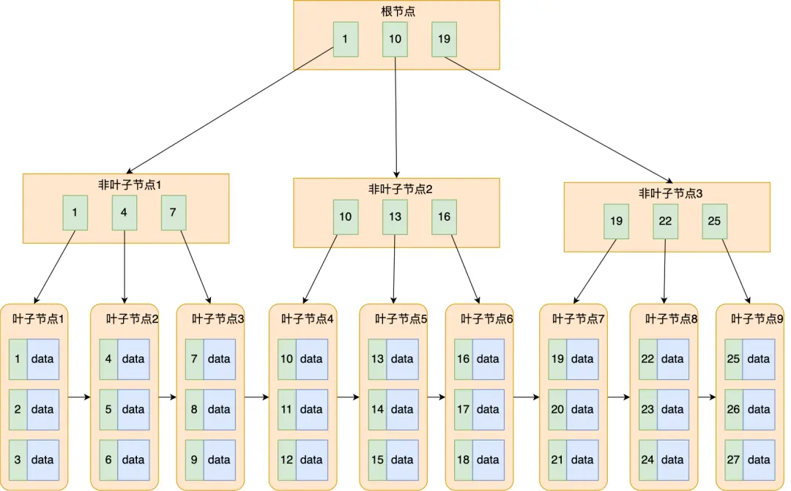
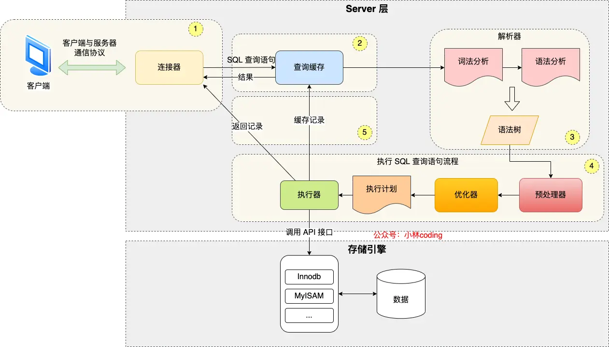
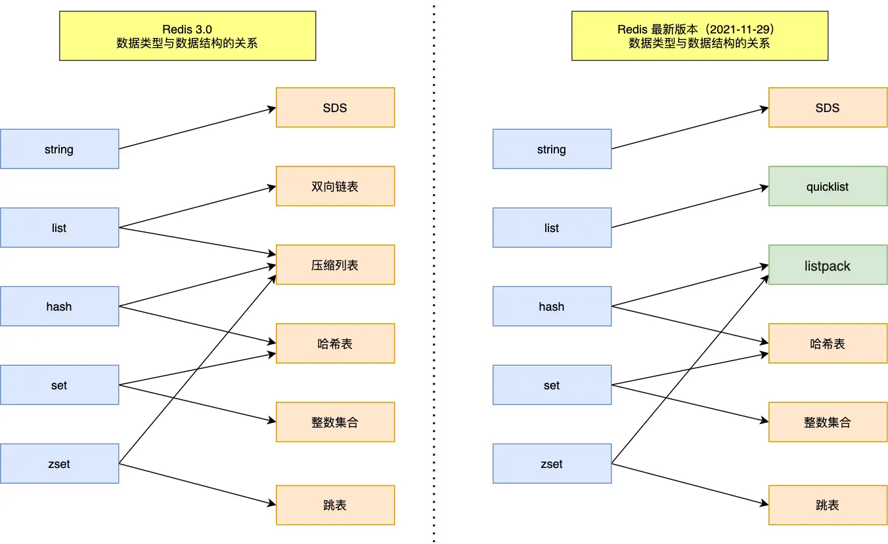
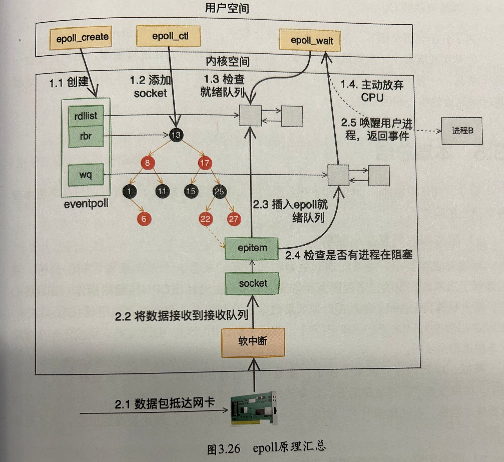
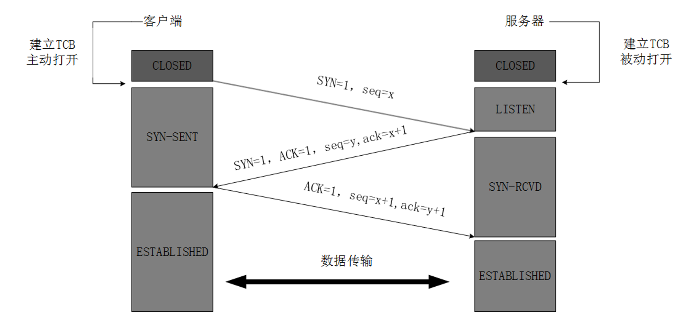
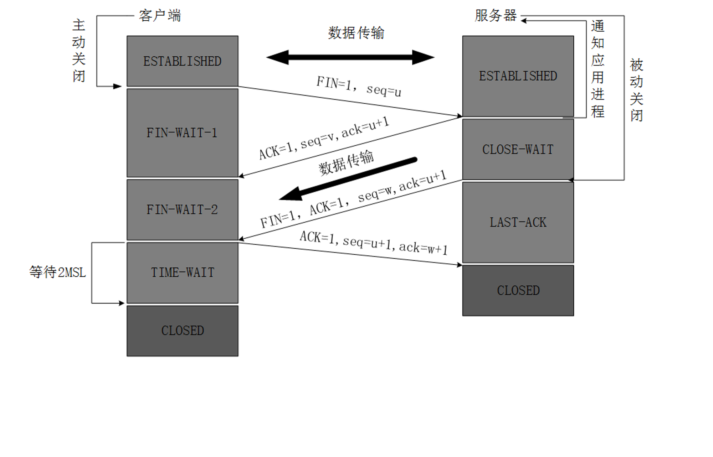
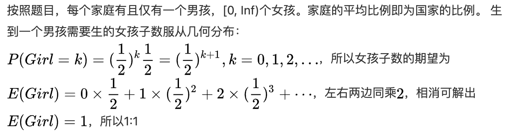

- 算法题
	- 有AB两个数组，判断B是否为A的子集。
	  :LOGBOOK:
	  CLOCK: [2023-07-04 Tue 15:29:35]--[2023-07-04 Tue 15:52:43] =>  00:23:08
	  :END:
		- [[LeetCode 392]] Is Subsequence #双指针 #动态规划
		- ```go
		  func isSubsequence(s string, t string) bool {
		      n, m := len(s), len(t)
		      f := make([][26]int, m + 1)
		      for i := 0; i < 26; i++ {
		          f[m][i] = m
		      }
		      for i := m - 1; i >= 0; i-- {
		          for j := 0; j < 26; j++ {
		              if t[i] == byte(j + 'a') {
		                  f[i][j] = i
		              } else {
		                  f[i][j] = f[i + 1][j]
		              }
		          }
		      }
		      add := 0
		      for i := 0; i < n; i++ {
		          if f[add][int(s[i] - 'a')] == m {
		              return false
		          }
		          add = f[add][int(s[i] - 'a')] + 1
		      }
		      return true
		  }
		  
		  作者：力扣官方题解
		  链接：https://leetcode.cn/problems/is-subsequence/solutions/346539/pan-duan-zi-xu-lie-by-leetcode-solution/
		  ```
	- 一个数字字符串，删除k个字符后，得到最小的数字。
		- [[LeetCode 402]] remove-k-digits #贪心 #单调栈
	- 合并股票价格区间随机从历史股票 K 线中找到股票的最低价和最高价集合, 求出合并后这批价格的不重合区间集合. `public int[][] getMergedPrice(int[][] klines) {}`参数:`klines = [[1, 4], [3, 4], [2, 5], [9, 10]]`, 表示三个日 K 线柱所表述的最低价和最高价价格区间返回:`[[1, 5], [9, 10]]`, 表示合并后的不重叠价格区间 #card
	  id:: 64984c93-686d-4833-a3c6-eb80823d7d08
		- 答案：对最低价排序，然后遍历比较上一个最高价和新的最低价，如果小于就加入数组，如果大于，就更新上一个最高价为Max(上一个最高价，新的最高价)
	- and.cd.efere.css 反转，要求反转后的 .分隔的单词顺序不变
	  :LOGBOOK:
	  CLOCK: [2023-07-11 Tue 18:37:07]--[2023-07-11 Tue 18:37:08] =>  00:00:01
	  :END:
		- 双指针，右指针先找到.的位置
	- 有20阶台阶，每次能走1步或者2步，请问一共有多少种走法；
		- 答案：动态规划，dp背包
	- 写一个函数，该函数实现如下功能：#card
	  id:: 64984a23-547f-48bd-9306-4a04b213d346
	  1. 输入一个尺寸字符串，返回其对应的整数尺寸。例如：
	  输入10K，返回10240（也就是10×1024）;
	  输入5.7M，返回5976883（也就是5.7×1024×1024，并取整）；
	  输入1.2G，返回1288490188（也就是1.2×1024×1024×1024，并取整）。
	  2. 只支持K\M\G三种单位。
	  3. 如果调用者输入的字符串的格式非法或数值超出范围[0,2^32)，则返回-1。
	  4. 如果调用者输入了一个纯数字（不含K\M\G）,则直接返回该整数。
		- collapsed:: true
		  ```go
		  package main
		  
		  import (
		  	"fmt"
		  	"strconv"
		  	"strings"
		  )
		  
		  func convertToNumber(sizeStr string) (int64, error) {
		  	sizeStr = strings.TrimSpace(strings.ToUpper(sizeStr))
		  
		  	if sizeStr == "" {
		  		return 0, fmt.Errorf("输入不能为空")
		  	}
		  
		  	unitConversion := map[string]int64{
		  		"K": 1024,
		  		"M": 1024 * 1024,
		  		"G": 1024 * 1024 * 1024,
		  		"T": 1024 * 1024 * 1024 * 1024,
		  	}
		  
		  	unit := string(sizeStr[len(sizeStr)-1])
		  	unitValue, ok := unitConversion[unit]
		  	if !ok {
		  		return 0, fmt.Errorf("未知的单位，请输入正确的单位（如：K, M, G, T）")
		  	}
		  
		  	numberStr := sizeStr[:len(sizeStr)-1]
		  	numberValue, err := strconv.ParseFloat(numberStr, 64)
		  	if err != nil {
		  		return 0, fmt.Errorf("请输入正确的数字")
		  	}
		  
		  	integerValue := int64(numberValue * float64(unitValue))
		  	return integerValue, nil
		  }
		  
		  func main() {
		  	testCases := []string{"10K", "1.1M", "1.23G", "1.5t", "", "1M2K", "G"}
		  
		  	for _, sizeStr := range testCases {
		  		result, err := convertToNumber(sizeStr)
		  		if err != nil {
		  			fmt.Printf("输入：%s，转换出错：%v\n", sizeStr, err)
		  		} else {
		  			fmt.Printf("输入：%s，转换结果：%d\n", sizeStr, result)
		  		}
		  	}
		  }
		  ```
	- 给定两个整数数组，arr1、arr2，数组元素按升序排列；假设从arr1、arr2中分别取出一个元素，可构成一对元素；求出和最小的k对元素
	  :LOGBOOK:
	  CLOCK: [2023-07-13 Thu 16:46:09]--[2023-07-13 Thu 16:46:10] =>  00:00:01
	  CLOCK: [2023-07-13 Thu 17:28:33]--[2023-07-13 Thu 17:28:33] =>  00:00:00
	  :END:
		- ```
		  package main
		  
		  import (
		  	"container/heap"
		  	"fmt"
		  )
		  
		  type Pair struct {
		  	sum    int
		  	index1 int
		  	index2 int
		  }
		  
		  type MinHeap []Pair
		  
		  func (h MinHeap) Len() int           { return len(h) }
		  func (h MinHeap) Less(i, j int) bool { return h[i].sum < h[j].sum }
		  func (h MinHeap) Swap(i, j int)      { h[i], h[j] = h[j], h[i] }
		  
		  func (h *MinHeap) Push(x interface{}) {
		  	*h = append(*h, x.(Pair))
		  }
		  
		  func (h *MinHeap) Pop() interface{} {
		  	old := *h
		  	n := len(old)
		  	x := old[n-1]
		  	*h = old[0 : n-1]
		  	return x
		  }
		  
		  func kSmallestPairs(arr1, arr2 []int, k int) [][2]int {
		  	if len(arr1) == 0 || len(arr2) == 0 {
		  		return nil
		  	}
		  
		  	minHeap := &MinHeap{}
		  	heap.Init(minHeap)
		      // 声明方式，划重点
		  	result := make([][2]int, 0)
		  	// 初始化，先把arr1和arr2[0]加入队列
		  	for i := 0; i < len(arr1) && i < k; i++ {
		  		heap.Push(minHeap, Pair{sum: arr1[i] + arr2[0], index1: i, index2: 0})
		  	}
		  
		  	// 循环条件很重要
		  	for i := 0; i < k && minHeap.Len() > 0; i++ {
		  		pair := heap.Pop(minHeap).(Pair)
		  		result = append(result, [2]int{arr1[pair.index1], arr2[pair.index2]})
		  		// 双指针技巧，以弹出的序列对的index1不变，移动index2
		          if pair.index2+1 < len(arr2) {
		  			heap.Push(minHeap, Pair{sum: arr1[pair.index1] + arr2[pair.index2+1], index1: pair.index1, index2: pair.index2 + 1})
		  		}
		  	}
		  
		  	return result
		  }
		  
		  func main() {
		  	arr1 := []int{1, 7, 11}
		  	arr2 := []int{2, 4, 6}
		  	k := 3
		  	fmt.Println(kSmallestPairs(arr1, arr2, k)) // 输出：[[1 2] [1 4] [1 6]]
		  }
		  ```
	- 一个图，然后让求任意两个节点之间的最少边数
		- bfs，stack
	- 求前k个高频的元素，按频次从高到低输出
	  case1
	  * 输入: [1,6,5,5,5,6,3,4,4,8] k=3
	  * 输出: [5,6,4]
		- [[LeetCode 347]] map+heapsort
	- 给出股票的价格变化列表，每天只能做一次买或者卖，求能获取的最大利润
		- [[LeetCode 121]] 遍历记录minPrice, maxProfit。相当于遍历算出每一天能获取的利润最大值，然后再取其中的最大值。而某天的利润最大值，就是天价格减去过去的最低价格。
- 计算机基础
	- [[mysql]]
		- 事务的 [[ACID]] 是什么意思 #card
		  id:: 64984c16-002b-44e6-a0b3-63abb0f2f044
			- 原子性，一致性，隔离性，持久性
			- {{embed ((64abcdeb-737d-49fb-a377-c13876652d89))}}
		- [[innodb事务实现]] #card
		  id:: 64984c07-bc74-45d6-a106-b1c0cb5b8566
			- A [[原子性]]： [[undo log]] （回滚），[[2PC]]（事务提交时，redolog和binlog的一致性）
			- C [[一致性]]：A I D
			- I [[隔离性]]： [[undo log]] （ [[mvcc]] ）， [[2PL]]
			- D [[持久化]]： [[redo log]] ，存储管理
			- 主要参考
				- ((64ce7f84-1e3f-4433-a603-9fd681b81d8e))
			-
		- 谈谈mysql索引，怎么提升查询速度等
			- [B+树](((64984e1e-7ac0-4270-85d9-2db316ddcd54))) ，[索引优化](((64a69e93-028b-4103-aaad-83b99692af3b)))
		- [[innodb索引]]是什么结构
		  :LOGBOOK:
		  CLOCK: [2023-07-13 Thu 16:49:13]--[2023-07-14 Fri 08:00:42] =>  15:11:29
		  :END:
			- B+树
		- [[B+树]]比B树有什么优势 #card #小林coding
		  id:: 64984e1e-7ac0-4270-85d9-2db316ddcd54
			- 差异
				- 
				- 叶子节点（最底部的节点）才会存放实际数据（索引+记录），非叶子节点只会存放索引；
				- 所有索引都会在叶子节点出现，叶子节点之间构成一个有序链表；
				- 非叶子节点的索引也会同时存在在子节点中，并且是在子节点中所有索引的最大（或最小）。
				- 非叶子节点中有多少个子节点，就有多少个索引；
			- 优势
				- 单点查询：B+树的非叶子节点可以存放更多的索引，因此 B+ 树可以比 B 树更「矮胖」，查询底层节点的磁盘 I/O次数会更少。
				  id:: 64ae673c-d521-471f-a857-6146bc629eb6
				- 插入和删除：插入可能存在节点的分裂（如果节点饱和），但是最多只涉及树的一条路径。删除大部分情况只需要改动叶子结点，不会发生复杂的树的变形。
				- 范围查询：B+ 树所有叶子节点间还有一个链表进行连接，这种设计对范围查找非常有帮助
				  id:: 64ae6764-8862-4442-8b10-545d705d5ba1
		- Mysql vchar和 char区别
			- char 是定长的，varchar 是变长的，变长字段实际存储的数据的长度（大小）不固定的。[src](https://xiaolincoding.com/mysql/base/row_format.html#_1-%E5%8F%98%E9%95%BF%E5%AD%97%E6%AE%B5%E9%95%BF%E5%BA%A6%E5%88%97%E8%A1%A8)
			  varchar(n) 字段类型的 n 代表的是最多存储的字符数量，并不是字节大小。比如 ascii 字符集， 1 个字符占用 1 字节，那么 varchar(100) 意味着最大能允许存储 100 字节的数据。[src](https://xiaolincoding.com/mysql/base/row_format.html#varchar-n-%E4%B8%AD-n-%E6%9C%80%E5%A4%A7%E5%8F%96%E5%80%BC%E4%B8%BA%E5%A4%9A%E5%B0%91)
			- MySQL 规定除了 TEXT、BLOBs 这种大对象类型之外，其他**所有的列**（不包括隐藏列和记录头信息）占用的字节长度**加起来不能超过 65535 个字节**。
			  id:: 64a6a5c6-9724-4fa0-ba0d-8539f574a609
		- 如何做索引优化
			- [[索引优化]] {{embed ((64a69e93-028b-4103-aaad-83b99692af3b))}}
		- 说一下覆盖索引 #card
		  id:: 64984e34-8e70-4e9d-8c88-5467d8cc39d5
			- {{embed ((64a69eb3-15b2-4d40-866d-bd1b069d358d))}}
		- 大表用limit查询有什么问题，如何分页查询效率高
			- 使用keyset分页，类似es的游标
			- 单独的索引表，存储少量关键信息，数据页内有更多记录
		- 字符串做索引需要注意什么，大字符串做索引怎么优化 #card
		  id:: 64985592-07ac-4718-b966-40718508a324
			- 字符串不要太长，以免索引空间占用过大
			- 索引区分度要高：count(distinct)数越高越好
			- {{embed [[字符串索引优化]]}}
		- 遇到过什么数据库上棘手的问题，如何解决
			- 跳单
			- 多维度查询与统计一致
			- 分页查询，使用页内最后一个结果标识加速
		- innodb的事务有哪些特性，有哪些隔离级别，可重复读是怎么实现的？
			- acid
			- 读未提交（脏读），读已提交（不可重复度），可重复度（幻读），串行化
			- MVCC+2PL（隔离性），间隙锁（解决幻读）
		- mysql执行一条sql的过程是怎样的？#card #小林coding
		  id:: 64ad31d1-6217-482c-b27c-c3fb109d78a9
			- 
			- 连接器：建立连接，管理连接、校验用户身份；
			- 查询缓存：查询语句如果命中查询缓存则直接返回，否则继续往下执行。MySQL 8.0 已删除该模块；
			- 解析 SQL，通过解析器对 SQL 查询语句进行词法分析、语法分析，然后构建语法树，方便后续模块读取表名、字段、语句类型；
			- 执行 SQL：执行 SQL 共有三个阶段：
				- 预处理阶段：检查表或字段是否存在；将 `select *` 中的 `*` 符号扩展为表上的所有列。
				- 优化阶段：基于查询成本的考虑， 选择查询成本最小的执行计划；
				- 执行阶段：根据执行计划执行 SQL 查询语句，从存储引擎读取记录，返回给客户端；
		- 微服务里服务之间通信是怎么寻址的？
			- 名字服务，DNS，vip
			- 在上面的基础上实现服务注册、发现、负载均衡
		- TODO tcp跟udp有什么区别？tcp怎么保证可靠通信？
		- 如果后端服务响应慢，怎么排查？如何定位mysql慢查询？#card
		  id:: 65433c67-15e0-4bfe-8c45-1f90f77372c4
			- 当后端服务响应慢时，可以通过以下几个步骤来排查问题：
				- 分析日志：检查后端服务的日志，查找慢响应的请求，分析请求的处理时间、请求的参数、返回的结果等信息，以便了解问题的具体情况。
				- 监控系统资源：查看服务器的CPU、内存、磁盘和网络等资源的使用情况，判断是否存在资源瓶颈。
				- 分析代码：检查后端服务的代码，了解代码执行的逻辑，查找可能导致性能问题的代码片段。
				- 性能测试：使用性能测试工具（如LoadRunner、JMeter等）对后端服务进行压力测试，找出性能瓶颈。
				- 分析数据库：检查数据库的性能，查询慢查询日志，找出慢查询SQL语句。
			- 定位MySQL慢查询的方法如下：
				- 启用慢查询日志：在MySQL的配置文件中启用慢查询日志功能，设置慢查询阈值（如1秒），将执行时间超过阈值的SQL语句记录到慢查询日志中。具体配置如下：
				  ```
				  [mysqld]
				  slow_query_log = 1
				  slow_query_log_file = /var/log/mysql-slow.log
				  long_query_time = 1
				  ```
				- 使用`mysqldumpslow`工具分析慢查询日志：`mysqldumpslow`是MySQL自带的慢查询日志分析工具，可以用来对慢查询日志进行统计和分析，找出最慢的SQL语句。使用方法如下：
				  ```
				  mysqldumpslow -s t /var/log/mysql-slow.log
				  ```
				- 使用`EXPLAIN`命令分析SQL语句：对于发现的慢查询SQL语句，可以使用`EXPLAIN`命令查看SQL语句的执行计划，分析是否存在索引、表连接、排序等性能问题。
				- 优化SQL语句：根据分析结果，优化慢查询SQL语句，如添加索引、修改表结构、优化查询条件等。
				- 定期清理慢查询日志：为了避免慢查询日志占用过多磁盘空间，建议定期清理慢查询日志。
	- redis
		- 说一下redis的hash和set的数据结构
			- 
			- Hash（哈希）：
				- Hash是一种字典结构。在 Redis 中，Hash 数据结构可以通过 HSET、HGET、HDEL 等命令进行操作。
				- Hash 数据结构在 Redis 内部使用字典（Dictionary）实现，字典是由哈希表（HashTable）构成的。哈希表使用开放寻址法（Open Addressing）解决哈希冲突，具有较高的存储和查询效率。
				- 当 Hash 数据结构中的元素数量较少时，且总空间不大时，Redis 会采用压缩列表（ZipList，<** Redis 7.0**，连续内存空间，只能遍历）,listpack(** Redis 7.0**，**listpack 没有ziplist中记录前一个节点长度的字段**，避免ziplist的连锁更新问题)进行优化，以减少内存占用。
			- Set（集合）：
				- Redis 的 Set 是一个无序且不重复的字符串集合。Set 数据结构支持添加、删除和判断元素是否存在等操作，同时还支持求交集、并集和差集等集合运算。
				- 在 Redis 中，Set 数据结构可以通过 SADD、SREM、SISMEMBER 等命令进行操作。
				- Set 数据结构在 Redis 内部使用整数集合（IntSet）和字典（Dictionary）实现。当 Set 中的元素都是整数且数量较少时，Redis 会使用整数集合（IntSet，连续内存整数数组）进行优化，以减少内存占用；当 Set 中的元素数量较多或包含非整数元素时，Redis 会使用字典（Dictionary）实现。
		- TODO redis hash结构的rehash过程
	- mq
		- kafka相关
			- 准备一下时间轮？
	- 网络
		- [[TCP三次握手]]之间传递了些啥？
		  id:: 64984c18-0ba4-454b-9ed6-1bcb1aa17390
			- 答案： 1. SYN, seq=x 2. SYN, ACK, seq=y, ack=x+1 3. ACK, seq=x+1, ack=y+1
		- 讲讲[[DDos]]攻击 #card
		  id:: 64984c1b-0e33-4b1c-9814-a79e9797680c
			- [src](https://www.notion.so/DDoS-1ff115b1020c42fb96dadcd9aef91041?pvs=4)
			- 分布式拒绝服务（Distributed Denial of Service，简称DDoS）是指将多台计算机联合起来作为攻击平台，通过远程连接，利用恶意程序对一个或多个目标发起DDoS攻击，消耗目标服务器性能或网络带宽，从而造成服务器无法正常地提供服务。
			- ## 常见的攻击类型
			- 畸形报文：服务端崩溃
			  logseq.order-list-type:: number
			- 传输层攻击：SynFlood、AckFlood、UDPFlood、ICMPFlood。只发送不回应。
			  logseq.order-list-type:: number
			- DNS攻击：海量域名查询，影响正常请求
			  logseq.order-list-type:: number
			- 连接型攻击：主要是指TCP慢速连接攻击、连接耗尽攻击、Loic、Hoic、Slowloris、 Pyloris、Xoic等慢速攻击
			  logseq.order-list-type:: number
			- web应用层攻击：模仿用户行为，海量访问
			  logseq.order-list-type:: number
			- [详解](((64afbb95-4d6d-4b67-a21e-7f93109b83ad)))
			- ## 攻击原理
			  通常，攻击者使用一个非法账号将DDoS主控程序安装在一台计算机上，并在网络上的多台计算机上安装代理程序。在所设定的时间内，主控程序与大量代理程序进行通讯，代理程序收到指令时对目标发动攻击，主控程序甚至能在几秒钟内激活成百上千次代理程序的运行。
			- ## 如何判断业务是否已遭受DDoS攻击？
				- 网络和设备正常的情况下，服务器突然出现连接断开、访问卡顿、用户掉线等情况。
				- 服务器CPU或内存占用率出现明显增长。
				- 网络出方向或入方向流量出现明显增长。
				- 您的业务网站或应用程序突然出现大量的未知访问。
				- 登录服务器失败或者登录过慢。
		- 讲一个服务A到服务B请求的过程，越底层越好
			- 在一个服务A到服务B的请求过程中，涉及到多个底层技术。以下是一个从较高层次到较低层次的描述：
			- 应用层（Application Layer）：服务A和服务B都是在应用层运行的程序。服务A需要向服务B发送请求，通常使用诸如HTTP、RPC等协议。服务A会将请求数据进行序列化（如JSON、XML、Protobuf等格式），然后通过底层的传输层协议发送给服务B。
			- 传输层（Transport Layer）：传输层主要负责在两个服务之间建立可靠的通信连接。最常见的传输层协议是TCP（传输控制协议），它提供了面向连接、可靠的数据传输服务。服务A和服务B之间的通信数据会被划分为多个数据包，每个数据包都包含了源端口、目标端口、序列号等信息，以确保数据正确无误地传输。
			- 网络层（Network Layer）：网络层负责将数据包从服务A传输到服务B。这一层通常使用IP（互联网协议）来实现。IP协议会为每个数据包添加源IP地址和目标IP地址，以便在复杂的网络环境中找到正确的传输路径。
			- 数据链路层（Data Link Layer）：数据链路层负责在相邻网络设备之间传输数据包。这一层会将数据包封装成帧（Frame），每个帧都包含了源MAC地址、目标MAC地址等信息。数据链路层还负责错误检测和流量控制。
			- 物理层（Physical Layer）：物理层负责在物理介质（如电缆、光纤等）上进行数据传输。数据链路层的帧会被转换成电信号、光信号或无线信号，在物理介质上进行传播。
			- 在整个请求过程中，数据会经过多次封装和解封装，最终从服务A传输到服务B。服务B收到请求后，会对数据进行反序列化，然后处理请求并将结果返回给服务A。整个过程涉及到多个协议和技术，保证了服务间的可靠通信。
		- 服务B访问不通，你是如何定位的 #card
		  id:: 64984da6-34f9-44b3-b6ce-56a4e62b1606
			- 检查网络连接：首先，检查服务A和服务B之间的网络连接是否正常。可以使用`ping`命令测试网络连通性。如果网络连接存在问题，请检查网络设备（如路由器、交换机等）的配置和状态。
				- 但是ping命令不准，有些情况ping不通是不准的。比如腾讯云跨vpc的时候。
			- 检查服务B的状态：确认服务B是否正在运行，以及是否在监听预期的端口。可以使用`telnet`或`nc`（netcat）命令测试端口的连通性。如果服务B未运行或未监听预期端口，请检查服务B的配置和日志，以确定导致问题的原因。
			- 检查防火墙规则：防火墙规则可能会阻止服务A和服务B之间的通信。请检查服务A和服务B所在主机的防火墙规则，确保允许相应的端口和协议通过。
			- 检查服务A的请求：检查服务A发送给服务B的请求是否正确，包括请求的URL、参数、HTTP方法等。可以使用抓包工具（如Wireshark或tcpdump）捕获网络数据包，以分析请求的详细信息。
			- 查看服务B的日志：服务B的日志中可能包含有关错误的详细信息。分析日志以确定问题的原因，例如内部错误、依赖服务故障等。
			- 服务B的性能问题：如果服务B的响应时间过长或负载过高，可能导致访问不通。检查服务B的资源使用情况（如CPU、内存、磁盘等），并考虑优化服务B的性能，例如增加资源、优化代码、使用负载均衡等。
			- 服务A的超时设置：检查服务A的请求超时设置，确保为合理的值。如果服务B的响应时间较长，可以考虑增加超时时间。
			- 通过以上步骤，我们可以逐步定位和排查导致服务B访问不通的原因，并采取相应的措施解决问题。在实际情况中，可能需要根据具体的场景和技术栈进行调整和补充。
		- ping和telnet分别是基于什么协议
			- 答案：ICMP、TCP
		- TODO Tcp time wait2状态遇到过吗
			- {{embed ((64b09373-8d75-404c-bb3a-429706f247f0))}}
		- epoll工作模式
			- epoll 是 Linux 下的 I/O 多路复用机制，相比于传统的 select 和 poll，epoll 在处理大量并发连接时能提供更高的性能。epoll 的工作模式主要包括以下几个方面：
			- 工作原理：
				- epoll 使用事件驱动的方式来处理 I/O 操作。当某个文件描述符（如套接字）上的 I/O 事件（如可读、可写、连接关闭等）发生时，epoll 会将这个事件通知给应用程序，从而避免了不必要的轮询操作。
				- epoll 通过内核和用户空间共享的事件表来存储感兴趣的 I/O 事件。当事件发生时，内核会更新事件表中的状态，而应用程序可以直接访问事件表来获取事件信息，这减少了事件通知的开销。
			- 工作流程：
				- 创建 epoll 实例：使用 `epoll_create` 或 `epoll_create1` 系统调用创建一个 epoll 实例。
				- 添加/修改/删除文件描述符：使用 `epoll_ctl` 系统调用向 epoll 实例添加、修改或删除感兴趣的文件描述符及其对应的事件。
				- 等待事件：使用 `epoll_wait` 系统调用等待感兴趣的事件发生。当事件发生时，`epoll_wait` 会返回已就绪的事件列表，应用程序可以遍历这个列表来处理事件。
				- 关闭 epoll 实例：使用 `close` 系统调用关闭 epoll 实例。
			- 工作模式：
			- LT（Level Trigger，水平触发）模式：当文件描述符上的事件处于就绪状态时，epoll 会持续通知应用程序。应用程序需要确保事件被完全处理，否则会导致重复触发。LT 模式适用于阻塞 I/O。
			- ET（Edge Trigger，边缘触发）模式：当文件描述符上的事件从非就绪状态变为就绪状态时，epoll 仅通知应用程序一次。应用程序需要一次性处理完所有事件，否则需要等待下一次状态变化。ET 模式适用于非阻塞 I/O，可以降低事件通知的开销。
			- 总之，epoll 是 Linux 下的 I/O 多路复用机制，通过事件驱动的方式来处理 I/O 操作。epoll 的工作模式包括 LT（水平触发）和 ET（边缘触发），分别适用于阻塞 I/O 和非阻塞 I/O。在实际应用中，需要根据具体的需求和场景选择合适的工作模式。
			- 
			- rdllist：双向链表，记录就绪的描述符
			- rbr：红黑树，记录了全部监听套接字描述符，支持海量连接的高效增删查
			- wq：双向链表，记录的是阻塞（主动让出CPU进入睡眠状态，挂起）的用户进程
		- TODO tcp/ip的timewait
		- [[netstat]]的输出包含什么内容？包含tcp连接的哪些状态？#TCP连接状态 #card
		  id:: 64ad326f-7cf8-4e9d-84ae-9506a865aa1f
			- -n 现实ip port的数字格式，-t tcp，-l listening监听，-p program进程名 pid
			- ESTABLISHED: The socket has an established connection.
			  SYN_SENT: The socket is actively attempting to establish a connection.
			  SYN_RECV: A connection request has been received from the network.
			  FIN_WAIT1: The socket is closed, and the connection is shutting down.
			  FIN_WAIT2: Connection is closed, and the socket is waiting for a shutdown from the remote end.
			  TIME_WAIT: The socket is waiting after close to handle packets still in the network.
			  CLOSED: The socket is not being used.
			  CLOSE_WAIT: The remote end has shut down, waiting for the socket to close.
			  LAST_ACK: The remote end has shut down, and the socket is closed. Waiting for acknowledgement.
			  LISTEN: The socket is listening for incoming connections. Such sockets are not included in the output unless you specify the **--listening** (**-l**) or **--all** (**-a**) option.
			  CLOSING: Both sockets are shut down but we still don't have all our data sent.
			  UNKNOWN: The state of the socket is unknown.
			- 
			  id:: 64b09373-8d75-404c-bb3a-429706f247f0
			  
	- linux
		- 分别说一下线程和进程，一个进程下面的线程，哪些资源是共享的，哪些是独占的
			- 进程（Process）：
				- 进程是一个程序在一个数据集上的一次动态执行过程，是操作系统进行资源分配和调度的独立单位。
				- 每个进程都有自己独立的内存空间，包括代码区、数据区和堆栈区。进程之间的内存空间是相互隔离的，一个进程不能直接访问另一个进程的内存。
				- 进程之间可以通过进程间通信（IPC）机制进行数据交换，如管道、信号、消息队列、共享内存等。
				- 进程具有一定的开销，创建、维护和销毁进程会消耗系统资源。
			- 线程（Thread）：
				- 线程是进程中的一个执行单元，是操作系统进行任务调度的基本单位。一个进程可以包含多个线程，这些线程共享进程的资源。
				- 线程相对于进程更轻量级，创建、切换和销毁线程的开销相对较小。
				- 同一进程下的线程共享进程的内存空间，包括代码区、数据区和堆区。这使得线程间的通信更加高效，但也需要注意同步和互斥问题，避免数据竞争和死锁。
				- 在一个进程下的多个线程中，以下资源是共享的：
					- 代码区，数据区，堆区
				- 以下资源是线程独占的：
					- 栈区，线程上下文：包括线程ID、寄存器值、优先级等线程运行所需的信息
		- 锁是基于什么原理，操作系统层面
			- 内核锁的实现通常结合了原子操作、内核调度和上下文切换等机制。例如，当一个线程获取不到互斥锁时，内核会将其挂起并调度其他线程运行，直到锁被释放。
				- 短时锁：原子操作，循环。自旋锁（适合内核，短时间临界区处理，不适合单核系统）
				- 长时锁：原子操作，内核调度
			- 锁可以分为用户态锁和内核态锁。用户态锁主要用于同一进程内的线程同步，实现相对简单，如自旋锁、无锁数据结构等。内核态锁主要用于跨进程的同步，需要内核的支持，如互斥锁、信号量（Semaphore）等。用户态锁相对轻量，性能较好；内核态锁功能更强大，但性能开销较大。
	- 语言
		- TODO golang map的实现和rehash过程（顺带介绍下redis的dict实现）
- 系统设计
	- 怎么设计一个高并发的项目？
		- 横向扩展，负载均衡
		- 熔断限流
		- 尽量化解分布式事务为单机队列任务，实现无锁化
		- 快慢分离，便于部署优化
		- 根据业务约束，强一致性同步，弱一致异步
		- 健全的微服务监控体系
	- 提升一个服务的qps的方式，QPS与系统资源的关系是？
		- 单实例：纵向扩容；优化代码：多线程，多进程，异步；绑核；用户态网络栈；
		- 分布式：水平扩容
		- 数据层：增加缓存；[[数据库优化]]
	- 有一个留言表一个用户表，使用sql求留言数最多的10个用户的姓名和留言数，给出表需要的索引；
		- 假设留言表（messages）和用户表（users）的结构如下：
		  
		  messages 表：
		- id：留言的唯一标识
		- user_id：留言用户的 ID
		- content：留言内容
		  
		  users 表：
		- id：用户的唯一标识
		- name：用户姓名
		  
		  要查询留言数最多的 10 个用户的姓名和留言数，可以使用以下 SQL 语句：
		  
		  ```sql
		  SELECT u.name, COUNT(m.id) AS message_count
		  FROM messages m
		  JOIN users u ON m.user_id = u.id
		  GROUP BY m.user_id, u.name
		  ORDER BY message_count DESC
		  LIMIT 10;
		  ```
		  
		  为了提高查询速度，我们需要在两个表中创建合适的索引。建议创建以下索引：
		  
		  1. 在 messages 表的 user_id 列上创建索引。这将加速 JOIN 操作和 GROUP BY 操作。
		  
		  ```sql
		  CREATE INDEX idx_messages_user_id ON messages(user_id);
		  ```
		  
		  2. 在 users 表的 id 列上创建索引。这将加速 JOIN 操作。
		  
		  ```sql
		  CREATE INDEX idx_users_id ON users(id);
		  ```
		  
		  通过创建这些索引，我们可以提高查询留言数最多的 10 个用户的姓名和留言数的速度。在实际应用中，可以根据具体的查询需求和场景进一步优化索引和查询语句。
	- 有一个交易系统，用户选好商品后下单，可以使用余额和红包进行支付，需要哪些系统去支撑这个流程？
		- 交易系统：订单，支付单
		- 资金系统：资金单
		- 结算系统：结算单
		- 余额系统：余额流水
		- 红包系统：红包单，红包流水
		- 账户系统：账户信息
		- 商品系统：商品记录，库存
		- 商户系统：商户
	- 分布式事务有哪些实现方式？用过哪一些？
		- 强一致：2PC、3PC（解决2PC中prepare超时的情况）
		- 弱一致/最终一致：上下游基于ACK机制的消息队列通信、TCC、SAGA
		- {{embed ((64b0236a-8eb5-4082-8601-a6b8bdbb316a))}}
	- 假设有60W/分钟的人次登录到富途牛牛APP，现在需要设计一个系统，对登录进来的每个用户，判断其在5分钟内是否登录过，请问这个系统可以如何实现？
		- redis string+TTL
	-
- 智力题
	- 两间房间，其中有间房间有三个开关，这三个开关控制了另一个房间的三盏灯，要求只进入一次三盏等所在的房间，怎么判断三个开关分别控制的是哪盏灯？
		- 答案：需要引入另一个控制量：比如开灯时间不同灯泡温度也不同，比如在一个开关上面加上整流器，灯泡会禅，或者调大电阻？
	- 一根钢管插入地下，钢管的粗细刚好有一个乒乓球大小，一个乒乓球掉进了钢管中，使用什么方式把乒乓球取出来。
		- 答案：灌水
	- 64匹马，8个赛道，每次比赛能知道相对顺序不知道具体时间，求用最少的比赛次数，求出最快的4匹 #
	- 一堆桃子分给一群猴子，如果每个猴子分3个，还剩59个；如果每个猴子分5个，那么最后一个猴子分得的桃子不够3个，你能求出有几只猴子，几个桃子吗？
		- 答案：用方程就行
	- 假设有一种疾病，发病率是 1/1000，同时其的检测结果的准确率挺高的。如果得病，检测的结果呈阳性，准确率是 99%。问：如果某人检测的结果呈阳性，那么他感染得病的概率是多少？
		- https://zhuanlan.zhihu.com/p/22467549
	- 一副扑克牌，没有大小王一共52张，从里面随机抽2张，问抽到颜色相等的概率是多少。
		- 答案：概率题，$\frac{C^1_{2}*C^{2}_{26}}{C^2_{52}}=\frac{25}{51}$，先选颜色，再抽两张
	- 一个国家，每对夫妻都重男轻女，生育后代，必须要生出男孩才停止生育，最终这个国家的男女比例是多少？
		- 
	- 两个人轮流抛掷硬币，谁先抛到正面谁赢，求两个人的胜率分别是多少 #card #概率
	  id:: 64984e9b-a70a-4994-8bae-4903d4e74042
		- 设甲胜率为x。则第一次甲抛了反面后（1/2），乙胜率为x，从而甲胜率+乙胜率=x+0.5x=1，从而x=2/3。
		- 使用概率公式来算
			- $P_y = P_b*P_b^y$
			- $P_y$代表乙获胜的概率，$P_y = 1- P_x$
			- $P_b$代表第一次甲抛了反面的概率，$=1/2$
			- $P_b^y$代表甲第一次抛了反面后，乙获胜的概率，$=P_x$，相当于乙先抛
			- $1-P_x = P_b*P_x = \frac{P_x}{2}$，$P_x = 2/3$
	- A,B,C三人轮流扔硬币，第一个扔到正面的人算赢，问三个人赢的概率分别为多大？
		- x+0.5x+0.25x=1，x=4/7
	- 一个1-8的均匀随机函数（能均匀的随机出1、2、3、4、5、6、7、8）求推导出一个能均匀随机1-5的均匀随机函数
		- 答案: var a int ; for a = rand8(); a>5; a=rand8() {}; return a;
	- 一个1-5的均匀随机函数（能均匀的随机出1、2、3、4、5）求推导出一个能均匀随机1-8的均匀随机函数
		- 答案：答案: rand25 = (rand5-1)*5 + rand5, rand8=rand24%8+1
	- 分针秒针
		- 一天的时间中，时针、分针、秒针有多少次重合？[知乎](https://www.zhihu.com/question/311942246/answer/1045945273)
	- 烧绳子计时
		- https://blog.csdn.net/ma950924/article/details/106494399
	- 在岛上有100只老虎和1只羊，老虎可以吃草，但他们更愿意吃羊。如果每次只有一只老虎可以吃羊，而且一旦他吃了羊，他自己就变成羊；而且所有的老虎都是聪明而且完全理性的，他们的第一要务是`生存`。 请问最后这只羊会不会被吃？如果是`n`只老虎和`一`只羊呢？
		- 1 只老虎，肯定吃;
		  2 只老虎肯定不吃，否则就被另一只吃了;
		  3 只老虎，如果一只老虎吃掉了羊，这样问题就转换为 2 只老虎和 1 只羊的情况，显然另外两种老虎不敢轻举妄动，所以羊会被吃；
		  4 只老虎，如果某一只老虎吃了羊，问题转化为 3 只老虎和 1 只羊的问题，它肯定会被接下来的某一只吃掉，然后其他两只只能等着，所以 4 只老虎，大家都不敢吃羊；
		- 奇数敢吃，偶数不敢吃
	- 有8个小球，其中一个偏重一些，但是不知道是哪一个。有一个天平，请问最少多少次能够把这个小球找出来？
		- [8个球称重](https://zhuanlan.zhihu.com/p/363928503)
		- 一个天平可以有三种状态：左重，平衡，右重。可以代表3叉树的三个分支，每次称重，可以对3组球，进行三选一。多一次称重，3叉树就多一层，叶子节点代表最终的所有可能状态。$log_3^n <= {depth}$
	- A城市20w人，B城市80w人，随机打电话50w，问跨城电话多少人
		- $$\frac{C_{20}^1*C_{80}^1 + C_{80}^1*C_{20}^1}{A_{100}^2}=\frac{32}{99}\approx32\%$$
		  $$32\%*50w=16w$$