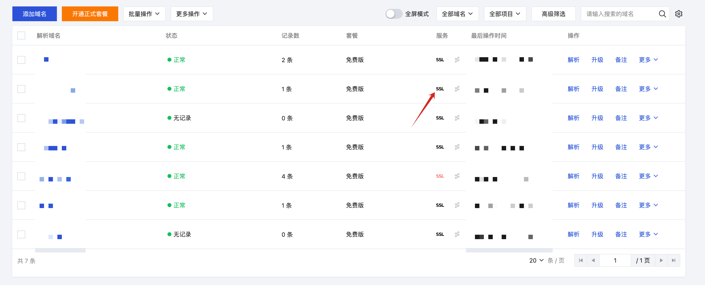
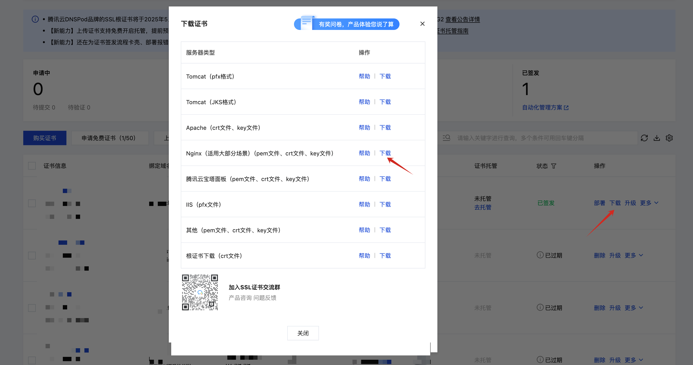

blog:: true
updated:: [[2025-10-20]]
created:: [[2025-10-16]]
status:: [[DONE]]

- > CVM厂商：腾讯云
  > 域名解析：腾讯云DNSPOD
  > 机型：SA2 4C4G
  > 操作系统：Ubuntu 24.04LTS
- ### 通过docker composer安装n8n
  
  ```bash
  # 安装docker 和 docker compose
  sudo apt install docker.io docker-compose -y
  
  # 下载n8n 
  git clone https://github.com/RTsien/n8n-hosting.git
  
  # 修改配置
  cd n8n-hosting/docker-compose/withPostgres
  vim docker-compose.yml # WEBHOOK_URL先提前改成准备使用的域名，比如 https://your.domain
  
  # 启动
  sudo docker-compose up -d
  
  # 关闭
  sudo docker-compose stop
  
  # 如果改动了docker-compose.yml，记得先rm再启动
  # rm不会导致数据丢失
  sudo docker-compose rm && sudo docker-compose up -d
  
  # 启动之后可以通过 http://yourip:5678 访问了
  # 如果无法访问，先检查腾讯云上的CVM网络完全组是否放开5678端口，顺便记得把443端口也打开
  ```
- ### 在腾讯云上为域名申请免费https证书
  在[这里](https://console.cloud.tencent.com/cns)申请免费ssl证书，成功后下载nginx类型的证书
   
  
  把解压出来的your.domain_bundle.crt和your.domain.key文件放置到CVM的`/etc/nginx/ssl_cert`路径
- ### 利用nginx配置反向代理
  ```bash
  sudo apt install nginx -y
  
  # 先移除nginx默认配置
  cd /etc/nginx
  sudo rm sites-enabled/default
  
  # 为域名添加反向代理
  # your.domain替换为你自己的域名
  sudo cat > sites-available/your.domain << 'EOF'
  server {
          #SSL 默认访问端口号为 443
          listen 443 ssl; 
          #请填写证书文件的相对路径或绝对路径
          ssl_certificate ssl_cert/n8n.richie.wiki_bundle.crt;
          #请填写私钥文件的相对路径或绝对路径
          ssl_certificate_key ssl_cert/n8n.richie.wiki.key;
          ssl_session_timeout 5m;
          #请按照以下协议配置
          ssl_protocols TLSv1.2 TLSv1.3;
          #请按照以下套件配置，配置加密套件，写法遵循 openssl 标准。
          ssl_ciphers ECDHE-RSA-AES128-GCM-SHA256:HIGH:!aNULL:!MD5:!RC4:!DHE;
          ssl_prefer_server_ciphers on;
          server_name n8n.richie.wiki;
          location ~ / {
                  proxy_pass http://127.0.0.1:5678;
                  proxy_set_header Host $host;
                  proxy_set_header X-Real-IP $remote_addr;
                  proxy_set_header X-Forwarded-For $proxy_add_x_forwarded_for;
                  proxy_set_header X-Forwarded-Proto https;
  
                  proxy_http_version 1.1; # Required for WebSocket
                  proxy_set_header Upgrade $http_upgrade; # Required for WebSocket
                  proxy_set_header Connection "upgrade"; # Required for WebSocket
          }
  }
  EOF
  
  # 在sites-enabled建立一下软链，使配置生效
  cd sites-enabled && sudo ln -s ../sites-available/your.domain
  
  # nginx重载最新配置
  sudo nginx -s reload
  
  # 这个时候可以使用 https://your.domain 来访问一下试试了
  ```
- ⚠️如果已经可以正常访问了，记得把之前在安全组里放开的5678端口删掉